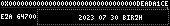

# ReapersGambit Epitaph

 _BEST NFT FOREVER_ (+†+)

Contract address: [0x46d0d00e847ed9C2756cfD941E70D99e9152A22f](https://etherscan.io/address/0x46d0d00e847ed9c2756cfd941e70d99e9152a22f) ([deployed source code](https://vscode.blockscan.com/ethereum/0x46d0d00e847ed9c2756cfd941e70d99e9152a22f))

# Roadmap
 - 2023
   - [ReapersGambit ERC20](https://reapersgambit.com/) (RG)
     - [Hourglass](https://twitter.com/figure31_/status/1652557541706981376)
     - [Wrapped Reaper](https://immortality.reapersgambit.com/) ([collection](https://opensea.io/collection/wrapped-reaper))
   - [BBScore Website](https://bb.reapersgambit.com/)
   - RG DAO
     - [Multisig](https://dappradar.com/hub/wallet/eth/0x89261878977b5a01c4fd78fc11566abe31bbc14e)
     - Start collecting LP RG/WETH & ETH
   - RG Epitaph
     - R&D
       - [Nym](https://nymtech.net/) Mixnet [Epitaph transmission](https://github.com/Magicking/37c3-rg-epitaph-nym-service)
     - Paint dApp v1
     - RG Epitaph v1 (rc1)
 - 2024
   - Paint dApp v2
     - [ ] Using Ordinal storage for ethernal UI storage
   - RG Epitaph v2 (rc2)
   - [ ] NFT Market places integration
   - RG DAO
     - ENS [rgepitaph.eth](https://app.ens.domains/rgepitaph.eth) subscribe for 50 years (Jan 14, 2075)
     - [ ] Define the transition from multi-sig to a voting system for RG holders
   - Start making/collecting soul & emotions

## Description

The NFT records a 128x24 pixel canvas with a unique [Truecolor](https://en.wikipedia.org/wiki/Color_depth#True_color_(24-bit))
It allows painting graffiti on the Ethereum Blockchain.

Paid in ETH, it uses the underlying token [ReapersGambit](https://reapersgambit.com/) for its birth and death mechanism.

### On-chain

Stored in the Ethereum Blockchain state, it lives forever rent-free (link to rent problem) along with the data of all the Ethereum mainnet RPC providers.

_Blessed be the free RPC providers_

### Dynamic

The unique rendering layer is EVM and thus requires the execution of the code of the [live contract](https://vscode.blockscan.com/ethereum/0x46d0d00e847ed9c2756cfd941e70d99e9152a22f); it pulls the state of the blockchain to render the image, changing on various criteria:
Who's viewing (msg.sender)
When it's displayed (RG alive status)
Block headers

It begins with the birth of the account, making it invisible to anyone except the owner for nine (9) days.

Full cycle 

#### Ephemeral view

Every 15 seconds, the rendering of the artwork is slightly modified such that it is imperceptible without a few minutes' observation of a human but is different from the point of view of the digital worlds where it lives and relies on.

To retrieve the current view, a function called `token URI (NFT_ID)` with an `eth_call` to an Ethereum mainnet RPC provider at the latest block height must be made to render, encode, and return the graphic to view the NFT.

_Artifact living in its realm_

#### Futur updates

This project will also grow through upgrades as Ethereum evolves with the [EIPs](https://eips.ethereum.org/).

### NFT

#### Rarity
 - 16777215 unique color available once.

 - Each drawing is the expression of a unique human touch.

 - Limited minting will last as long as there is enough [RG liquidity](https://v2.info.uniswap.org/pair/0x8ab0ff3106bf37b2db685aafd458baee2128d648).

#### Tokenomics

 - 80% goes to the RG DAO Multisig; the funds buy back RG tokens and put them back as liquidity to the [RG/WETH](https://v2.info.uniswap.org/pair/0x8ab0ff3106bf37b2db685aafd458baee2128d648) pair on Uniswap v2.

 - 20% goes as an artist commission.

## User Interface

 [Pixel Art Paint Decentralized Application](https://github.com/Magicking/nft-epitaph-front) (dApp)

 It is a retro terminal-themed web application that allows you to paint and visualize the epitaph.

#### Artwork

##### Gift

This project is a gift to the RG holders through the DAO.

##### Rebirth

Almost no activities, to a down capital; there should be a bump each time there is a mint.

##### Inscriptions

A project that allows users to inscribe an NFT with its emotions, stealing a bit of time and soul.

##### Prior work

It's based on the Reaper's Gambit project, as it allows for dead accounts to be honored with style.

It comprises a set of smart contracts and a [web interface](https://github.com/Magicking/nft-epitaph-front); no third-party hosting is required to see the NFT, making it resilient to nuclear wars.

# Authors
## [SkyLight](https://sky-light-sl.com/)
